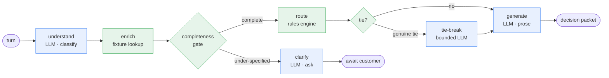

# Triage Orchestrator

A support-conversation orchestration service for a contact-center pipeline. It takes an inbound
customer message (text or voice), **understands** it (multi-issue extraction, sentiment, urgency,
business impact), **enriches** it with customer context, runs it through a **controlled,
deterministic orchestration flow**, and emits a structured **decision packet** — customer reply,
internal summary, routing decision, escalation recommendation, next action — with every decision
logged and auditable.

The core principle: **the LLM is confined to classification and prose; every decision that matters
is made by a deterministic rules engine.** Control flow is plain Python; the LLM runs only inside
graph nodes, constrained to schema-validated outputs.

Docs: [`docs/requirements.md`](docs/requirements.md) (what & why) ·
[`docs/design.md`](docs/design.md) (how) · [`docs/build-plan.md`](docs/build-plan.md)
(living build log) · [`AI_WORKFLOW.md`](AI_WORKFLOW.md) (how it was built with AI).

## Architecture at a glance



Green = deterministic Python (control flow + every routing/escalation decision). Blue = the LLM,
boxed into classification and prose. The gate clarifies an under-specified message until its budget
is exhausted, then force-routes to a human.

- **Orchestration:** LangGraph; conditional edges are deterministic; the LLM only runs in nodes.
- **Decisions:** a pure rules engine (escalation rules, modifiers, reconciliation) — never the LLM.
- **Seams:** `LLMProvider` (OpenAI / heuristic / fake) and `Transcriber` (Deepgram / fake), so it
  runs key-less and is testable without live calls.
- **Durability/async:** Postgres checkpointer + audit log; arq worker; Redis idempotency + locks;
  SSE progress stream.

## Quickstart — key-less, no infrastructure

Requires Python 3.12 and [uv](https://docs.astral.sh/uv/).

```bash
uv sync
uv run pytest            # full suite (infra-dependent tests skip cleanly)
uv run uvicorn triage.main:app    # inline mode, in-memory, heuristic LLM

# in another shell:
curl -s localhost:8000/health
CID=$(curl -s localhost:8000/v1/conversations -H 'X-API-Key: dev-key' \
  -H 'Content-Type: application/json' -d '{"customer_id":"cust_4821"}' \
  | python -c 'import sys,json;print(json.load(sys.stdin)["conversation_id"])')
curl -s localhost:8000/v1/conversations/$CID/messages -H 'X-API-Key: dev-key' \
  -H 'Content-Type: application/json' \
  -d '{"text":"the API is down and billing is unavailable, urgent"}' | python -m json.tool
```

## Run the full stack (Docker)

Brings up the API, the arq worker, Postgres, and Redis (durable + queued + SSE):

```bash
docker compose up --build
# POST a message → 202 + job_id; poll GET /v1/jobs/{id}; stream GET /v1/conversations/{id}/stream
```

## Modes (env-configured)

| Setting | Values | Effect |
|---|---|---|
| `TRIAGE_PERSISTENCE` | `memory` \| `postgres` | in-memory vs durable checkpointer + repos |
| `TRIAGE_EXECUTION` | `inline` \| `queue` | run the graph in-request vs enqueue to the arq worker |
| `TRIAGE_LLM_PROVIDER` | `heuristic` \| `openai` | key-less keyword classifier vs OpenAI (`gpt-5.4-mini`) |
| `TRIAGE_TRANSCRIBER` | `fake` \| `deepgram` | preset vs Deepgram nova-3 |

Real providers need keys: `TRIAGE_OPENAI_API_KEY` (+ `TRIAGE_LLM_PROVIDER=openai`) and
`TRIAGE_DEEPGRAM_API_KEY` (+ `TRIAGE_TRANSCRIBER=deepgram`). See [`.env.example`](.env.example).

## Endpoints

- `POST /v1/conversations` — start a conversation
- `POST /v1/conversations/{id}/messages` — submit a turn (inline → `200`+decision; queue → `202`+`job_id`)
- `POST /v1/conversations/{id}/voice` — submit audio (transcribed, then identical pipeline)
- `GET  /v1/conversations/{id}` — current status + last decision
- `GET  /v1/conversations/{id}/audit` — the append-only decision log
- `GET  /v1/conversations/{id}/stream` — SSE node-by-node progress (queue mode)
- `GET  /v1/jobs/{id}` — poll a queued job (queue mode)
- `GET  /health`

## Evaluation & quality gates

```bash
uv run python eval/run_eval.py    # golden-set routing/escalation accuracy
uv run pytest                     # tests
uv run ruff check                 # lint
uv run pyright                    # type-check
```
