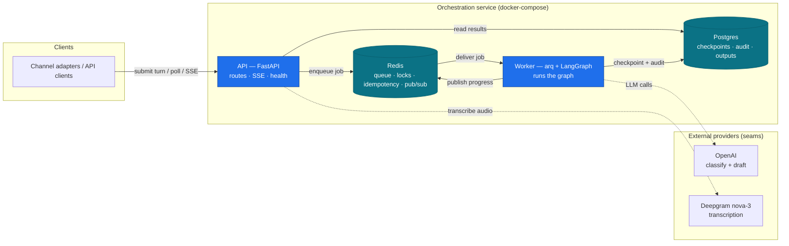
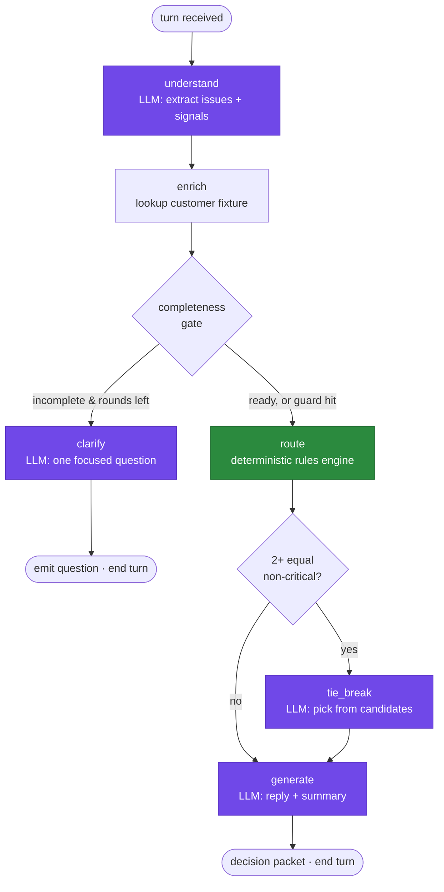
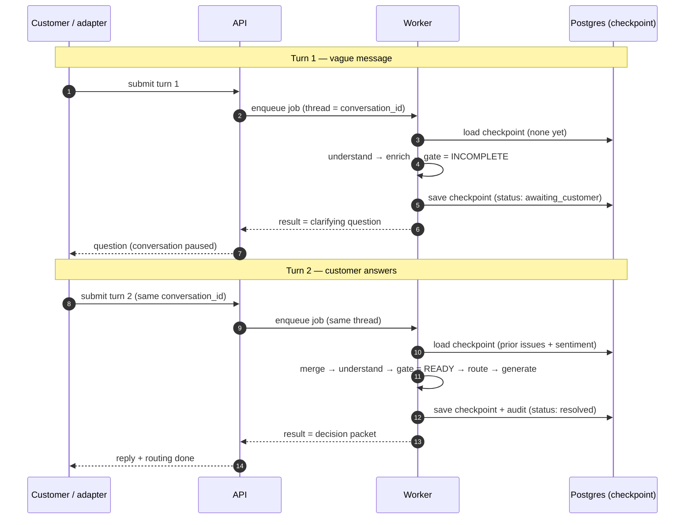

# Technical Design — Support Conversation Orchestration Service

| | |
|---|---|
| **Doc type** | Technical Design (architecture overview) |
| **Status** | Draft v1 |
| **Owner** | Suleman |
| **Date** | 2026-05-31 |
| **Related** | `requirements.md` (the product spec / WHAT) |

> **Scope of this document.** This is the **HOW** companion to `requirements.md` (the **WHAT**). It's an *architecture overview* — component structure, the orchestration engine, the production mechanics, and the rationale behind each major choice. It deliberately stops short of code-level interface signatures, schemas, and pseudocode; those emerge during implementation. Where a concept is already defined in the requirements (domain taxonomy, business rules, personas), this doc references rather than repeats it.

---

## 1. Design goals & principles

The design exists to satisfy the High-weighted product goals: controlled AI orchestration, deterministic/auditable decisions, multi-turn conversation, and production operability (see requirements G1–G6, NFR-1–NFR-10). Six principles drive every structural choice:

- **P1 — Deterministic control flow; probabilistic only at the edges.** *Which* step runs next is always plain Python. The LLM runs only *inside* nodes, on bounded, schema-validated tasks.
- **P2 — Rules own every decision that matters.** Routing, escalation, and priority come from a pure rules engine. The LLM classifies (input) and writes prose (output); it never silently decides a route.
- **P3 — Everything external sits behind a seam.** The LLM and transcription are interfaces with a real implementation and a deterministic fake — so the orchestrator is testable without a live model and providers are swappable.
- **P4 — The conversation is the unit of work.** State is durable and resumable; a turn is one pass over accumulated state, not an isolated request.
- **P5 — Async, idempotent, observable by default.** Work runs in a worker, retries are safe, and every decision is traceable.
- **P6 — Fail safe, not fail confident.** When the model is slow, down, or returns junk, the system degrades to a human handoff — never to a confident wrong answer.

---

## 2. High-level architecture

Four processes run under docker-compose, with two external providers behind seams.



**Responsibilities:**
- **API (FastAPI)** — thin edge. Checks a static API key, validates input, transcribes audio at the boundary (so the pipeline is uniformly text-driven), enforces idempotency, enqueues a job, and exposes poll + SSE retrieval and health checks. It does *not* run the graph.
- **Worker (arq + LangGraph)** — runs the orchestration graph for one turn, reads/writes checkpoints, writes the audit log, and publishes node-transition events. Horizontally scalable.
- **Postgres** — durable system-of-record: LangGraph checkpoints, the append-only audit log, and final decision outputs.
- **Redis** — the operational plane: arq job queue, per-conversation locks, idempotency keys, and the pub/sub channel for SSE progress.

> **Design note — where transcription runs.** Doing it at the API edge surfaces transcription failures synchronously (a clean 4xx/5xx) and keeps the worker text-only. The trade-off is added latency before the `202`; if that becomes material, transcription moves into the worker as the first node. Either way it's behind the same seam.

---

## 3. Module structure

A layered structure with dependencies pointing inward. The decision core has no I/O; I/O lives at the edges behind interfaces.

```
core           → cross-cutting: config, lifespan, db/redis/pubsub clients, errors, logging, API-key auth
conversations  → the domain slice:
                   · api/v1/endpoints  (interface)
                   · services          (application service — wraps & drives the graph)
                   · orchestration     (LangGraph graph: nodes, conditional edges, merge, checkpointer)
                   · decision          (PURE rules: gate, rules, reconcile, tie-break — zero I/O)
                   · repositories      (abstract interface + Postgres implementation)
                   · models            (Pydantic schemas, enums, graph state)
providers      → seams: llm (OpenAI + Fake), transcription (Deepgram + Fake)
worker         → async: arq tasks, messaging (queue + pub/sub), handlers (turn + dead-letter), concurrency (lock/idempotency/coalesce)
```

Dependencies point inward: `api → services → orchestration/decision`, and the **decision** layer (pure rules) depends on nothing but the models — so it, and the graph running on the fake provider, is unit-testable in isolation. Data access goes through **repository interfaces** (an abstract interface + a Postgres implementation), so services depend on abstractions, not SQL. The **providers** layer is the only code that talks to external services, always through an interface. The **service layer** supplies identity/context (`customer_id`, `conversation_id`) to the graph from validated request data — never from raw message text. This is what makes "clean architecture" and "testable without a live LLM" concrete rather than aspirational.

---

## 4. Orchestration engine (LangGraph)

The graph processes **one turn**. Nodes that call the LLM are bounded to schema-validated tasks; the single deterministic `route` node owns the decisions.



**The determinism boundary** is visible in the colors: purple nodes call the LLM (classify, ask, tie-break-pick, write), the green `route` node is pure Python, and the diamonds (`gate`, `tiebreak`) are deterministic edge functions. No edge is ever chosen by the model.

**Multi-turn via resume-from-checkpoint.** Each turn is a *separate job* that resumes the conversation's thread from its Postgres checkpoint. A clarification doesn't hold a run open — the graph reaches the `clarify` node, emits the question, and the turn **ends**; the next turn re-enters the graph with the prior state loaded and the new message merged in.



> **Why resume-per-turn over LangGraph `interrupt`?** An interrupt holds a single run open waiting for human input — which doesn't fit an async, job-per-turn, horizontally-scaled worker (you'd pin a conversation to a held coroutine). Resume-from-checkpoint makes every turn stateless at the process level: any worker can pick up any turn, because all the state is in the checkpoint. It also makes the clarify loop and the max-turns guard trivial to reason about — they're just gate outcomes across independent runs.

**State merge.** Each turn's freshly-extracted understanding is merged into the accumulated conversation state (issues union, urgency/impact take the max, sentiment refreshes, history grows). The merge is deterministic Python, so it's directly testable.

**Max-turns guard is per *episode*.** The clarification counter is reset when a turn resolves, so the budget bounds a single under-specified episode — a returning conversation that once asked a question isn't penalised on its next, unrelated message.

**Tie-break** (`tb`) only runs when the rules engine returns ≥2 equally-valid non-critical team candidates for a *complete* decision. The candidate set is formed when the message-derived primary owner disagrees with an **enrichment-derived candidate** — the specialist team implied by a focused (single-specialist-product) customer's footprint. The LLM picks from that exact set; an invalid/timed-out pick falls back to a deterministic choice. It never touches escalation, critical routing, or the under-specified safety fallback, and every fire is audited (`T1`).

---

## 5. The seams (swappable boundaries)

Three abstractions isolate the non-deterministic / external parts:

- **`LLMProvider`** — one implementation calls **OpenAI** with native JSON-schema structured outputs for schema-bound results; the model is set via env (default `gpt-5.4-mini`), with per-node overrides if tiering is wanted later; a **fake** returns scripted, deterministic responses for tests. The graph depends only on the interface, so CI never makes a live call.
- **`Transcriber`** — **Deepgram nova-3** for real audio; a **fake** for tests. Selected and configured by env.
- **Rules engine** — not a class hierarchy but a set of **pure, ordered functions** (completeness gate, escalation rules R1–R4, modifiers, auto-resolve, reconciliation, tie-break trigger). Pure because that's what guarantees determinism and lets us assert behavior exhaustively without any I/O. Each function contributes to a structured rationale that lands in the audit log.

---

## 6. Production mechanics

- **Async execution (arq).** The API enqueues a job and returns `202 + job_id`; a worker consumes it. This decouples request latency from LLM latency and lets workers scale independently.
- **SSE progress relay.** As the worker advances through nodes it publishes events to a Redis pub/sub channel keyed by `conversation_id`; the API's SSE endpoint subscribes and relays them, sending ~15s heartbeat keepalives to survive idle-connection proxies. On disconnect the client falls back to poll (`GET /jobs/{id}`), which is the authoritative always-works contract — so the stream needs no durable event replay. *(This relay is the single fiddliest integration — see risks.)*
- **Idempotency.** A client-supplied `Idempotency-Key` (falling back to a hash of `conversation_id` + turn if absent) is checked in Redis (with TTL) before enqueuing; a replay returns the original `job_id` instead of starting duplicate work or writing duplicate audit rows.
- **Concurrency.** A per-conversation Redis lock serializes execution — a lease the worker renews by a background **heartbeat** (every `lease / 3`) while a turn runs, auto-expiring by TTL if the worker dies, so a slow multi-call turn can't lose the lock and a crashed worker can't deadlock the conversation. *(Burst coalescing — merging messages a customer sends before the first response — was scoped out as a deferred optimization; one response per turn is the current contract.)*
- **Reliability.** Retry-with-backoff at two layers: per-LLM-call inside a node, and per-job at the queue. On exhaustion or invalid output, the graph degrades gracefully — route to `tier1_support` with `human_review_required` — honoring P6. Jobs that still fail after retries are routed to a **dead-letter handler** that parks them and flags the conversation for human review — no silent drops.
- **Observability.** `structlog` emits JSON with correlation IDs (`conversation_id` / `job_id` / `turn` / `node`) propagated across the async boundary via the job payload; the same key events and timings (escalations, tie-break fires, retries, failures, clarifications; per-node, end-to-end, LLM latency/tokens) are emitted as structured log fields, so they can be shipped to any log aggregator; raw message text is redacted (email/phone/card-like patterns) and kept out of logs, living only in the durable store. Health/readiness endpoints check Redis + Postgres. A Prometheus `/metrics` endpoint and OTel tracing are deferred to production.
- **Configuration.** All settings via env (pydantic-settings): provider keys, model names, DB/Redis URLs, and the tunable policy parameters (clarification cap, retry/timeout limits).

---

## 7. Data & persistence

- **Postgres = durable system-of-record.** It holds LangGraph's checkpoint tables (conversation state per thread), the **append-only audit log** (inputs, structured outputs, rules fired, tie-break fires, model/version, timings), and the final decision outputs for retrieval. The conceptual entities and their cardinality (one conversation → many turns → many issues → one decision packet) are in requirements Section 6.
- **Redis = operational plane.** Job queue, idempotency keys (TTL), per-conversation locks (lease), and pub/sub channels for SSE. Nothing here is the source of truth — it can be flushed without losing a conversation.
- **Schema management.** LangGraph manages its checkpoint tables via its own setup; the handful of additional tables (audit log, outputs) are created with a lightweight, idempotent DDL step run at startup. Alembic is deferred to production.
- **Data access.** All Postgres access goes through **repository interfaces** (an abstract interface + a Postgres implementation); the service and orchestration layers depend on the abstraction, which keeps SQL out of the domain logic and lets tests substitute an in-memory repository. Implemented with **psycopg** — one async driver, one shared pool for both the repositories and the `AsyncPostgresSaver` checkpointer (no second ORM/driver stack for two tables).

---

## 8. Testing & quality strategy

Built on the seams so it's deterministic and CI-safe:

- **Unit** — the rules engine, completeness gate, state-merge, max-turns guard, idempotency logic, tie-break fallback. Pure functions, no mocks beyond inputs.
- **Integration (graph-level)** — run the full LangGraph with the **`FakeProvider`** feeding scripted outputs; assert routing/escalation/output for canned scenarios, including the multi-turn clarify loop.
- **API** — `httpx`/TestClient over the endpoints: the 202+job flow, idempotency replay, concurrency lock, max-turns exhaustion, SSE smoke.
- **Evaluation harness** — a labeled golden set (~15–20 scenarios) scoring classification + routing accuracy, runnable on demand against the **real** LLM to measure quality (distinct from the deterministic CI tests).

Representative **edge cases** the suite must cover: invalid/again-invalid LLM output, transcription failure, unknown customer (safe defaults), empty/garbage message, concurrent same-conversation submits, max-turns exhaustion → human handoff, duplicate submission (idempotency), and SSE client disconnect.

---

## 9. Deployment & operations

- **Local / demo** — `docker compose up` brings up `api`, `worker`, `postgres`, `redis`. Startup waits for Postgres + Redis to be ready and runs the migration step before serving. A README documents env setup (`OPENAI_API_KEY`, `DEEPGRAM_API_KEY`, model names) and example requests.
- **Scaling** — the API is stateless; throughput scales by adding workers behind the shared queue and shared state. No in-process state is required for correctness (P4/P5). For this build the worker shares the API image (a different start command); at scale it becomes its own deployable service.
- **Production next steps (documented, not built)** — OpenTelemetry distributed tracing across the async boundary; CI/CD with the test pyramid as a gate; container orchestration (k8s) with autoscaled workers; a secrets manager; per-tenant auth in front of the API; edge rate limiting (token-bucket per customer / API-key); and metrics export (Prometheus `/metrics`).
- **Considered & deferred — grounded RAG for deflection.** A `pgvector` KB table, an `EmbeddingProvider` seam, a `retrieve` graph node, and a similarity-confidence gate would let `auto_resolve_with_kb` return a *grounded* answer (falling back to the templated pointer / human handoff on a weak match). Deliberately left out to keep this build's scope on orchestration; the existing seams make it a drop-in addition.

---

## 10. Key trade-offs & risks

| Decision | Chosen | Alternative | Why chosen |
|---|---|---|---|
| Orchestration | LangGraph | Hand-rolled state machine | Industry-standard, free checkpointing + streaming, conditional edges fit the flow |
| Decision authority | Rules-first + bounded tie-break | LLM-decided routing | Determinism, auditability, reduce drift (the core requirement) |
| Multi-turn | Resume-from-checkpoint per turn | LangGraph `interrupt` (held run) | Stateless workers; trivial loop/guard reasoning; any worker resumes any turn |
| State stores | Postgres + Redis | Single store | Each has a non-overlapping job: durable SoR vs operational plane |
| Execution | Async worker (arq) | Synchronous in-request | Decouple LLM latency; horizontal scale; safe retries |
| Transcription | At the API edge | In the worker | Surface failures synchronously; keep the pipeline text-uniform |

**Top engineering risks:**
1. **SSE-over-worker relay** — worker → Redis pub/sub → API SSE is the most complex integration; poll is the fallback if it slips.
2. **PostgresSaver setup** — async pool + table setup can absorb time; budget for it early.
3. **LangGraph version churn** — pin versions; keep node logic thin so the framework surface area we depend on stays small.

---

## 11. Settled implementation decisions

Resolved during scoping; reflected in the sections above:

- **Schema management** — lightweight, idempotent DDL at startup (LangGraph `.setup()` for its checkpoint tables + create-if-not-exists for the audit/output tables). Alembic deferred to production.
- **Lock & idempotency** — the per-conversation lock is a **lease renewed by heartbeat** while a turn runs, auto-expiring by TTL if the worker dies; idempotency keys live ~24h.
- **SSE resilience** — ~15s heartbeat keepalives; on disconnect clients fall back to `GET /jobs/{id}` (the authoritative contract), so the stream needs no durable event replay.
- **Decision-packet versioning** — an explicit `schema_version` field inside the packet; URL/Accept-header versioning deferred to the public-API step.
- **Concurrent turns** — a per-conversation lock serializes execution; bursts (messages sent before the first response) are coalesced into one pass via a short configurable debounce (best-effort; 0 disables → one response per turn).
- **Auth** — a static shared API key guards all endpoints; per-tenant auth/RBAC deferred.
- **Understanding rubric** — urgency and business-impact are classified against explicit level definitions in the prompt, for run-to-run consistency.

*Rate limiting is out of scope for this build (deferred — see requirements 5.2 and Section 9 production next steps).*
