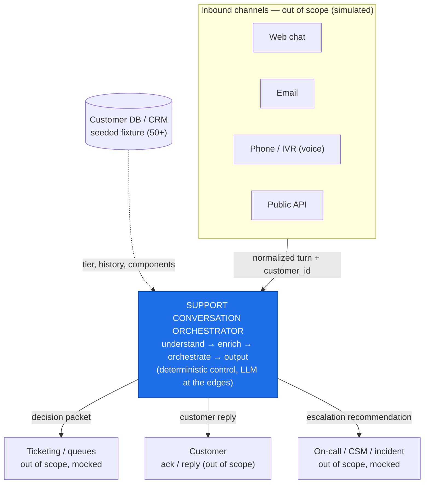
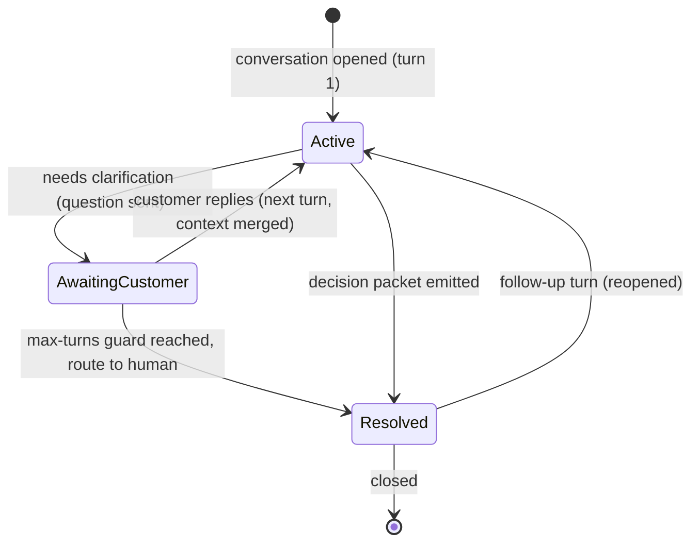
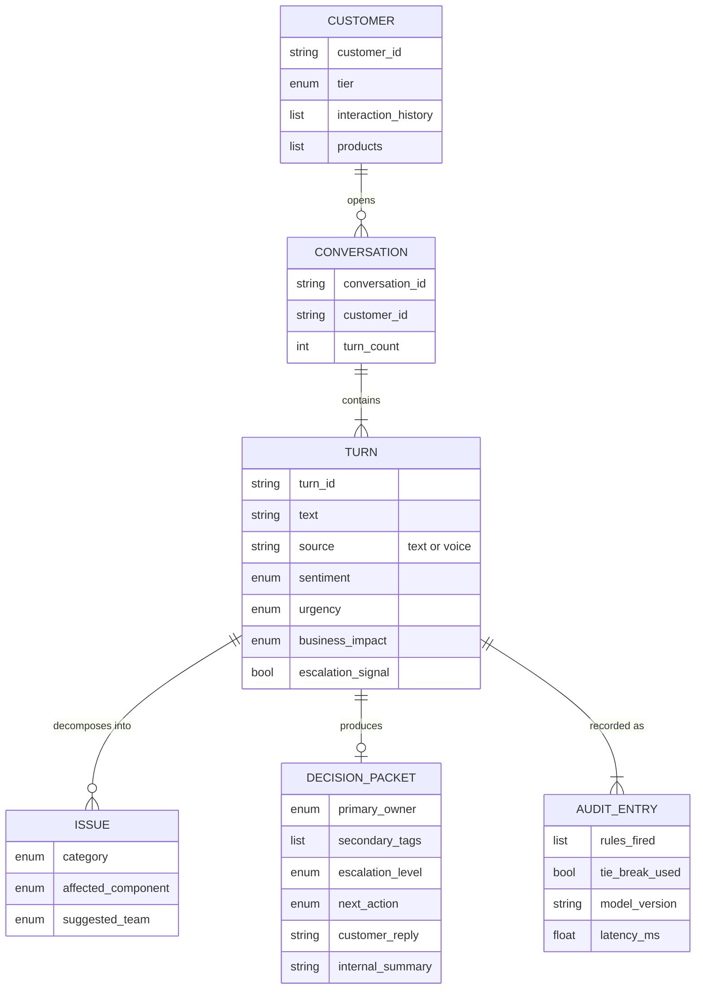
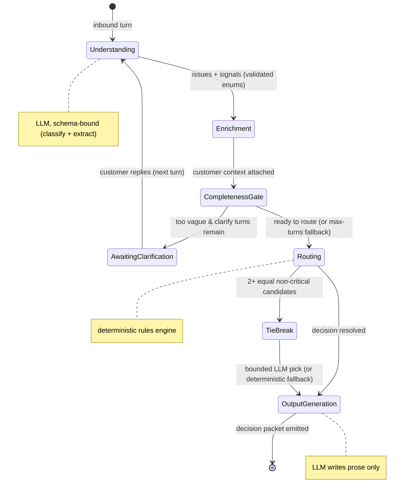
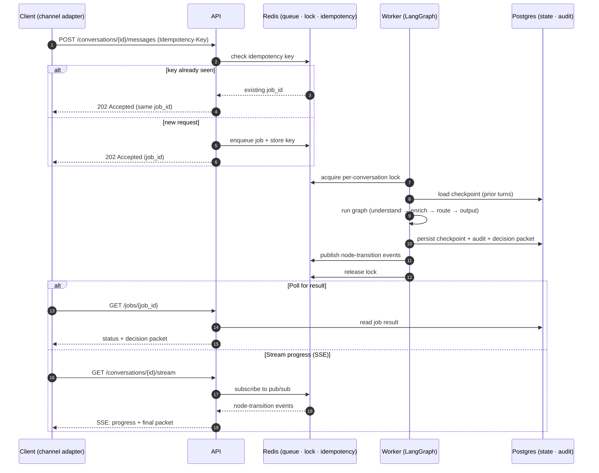

# Product Requirements — Support Conversation Orchestration Service

| | |
|---|---|
| **Working name** | Meridian Triage Copilot (internal codename: `triage-orchestrator`) |
| **Doc type** | Product Requirements (product perspective) |
| **Status** | Draft v1 — scope baseline |
| **Owner** | Suleman |
| **Date** | 2026-05-31 |
| **Related** | Technical design & architecture decisions (see Section 13) |

> **Why this document exists.** This document defines *what* the Support Conversation Orchestration Service must do and *who* it serves — the product context, users, scope boundary, domain model, routing policy, and success criteria — so that every engineering decision can be justified by who it serves and why. Treat this as the product spec; a separate design/architecture doc (Section 13) covers *how* we build it.

---

## 1. Executive summary

**Meridian** is a B2B SaaS company selling a reporting, analytics, and billing platform to business customers, accessed via a web app and iOS/Android apps. Like every SaaS company at scale, Meridian's support operation is drowning in inbound volume that is **noisy, multi-problem, and inconsistently triaged**. A single inbound message often contains several distinct problems, varying urgency, and emotional signal — and a human agent has to read it, figure out what's wrong, look up who the customer is, decide who should handle it, decide whether to escalate, and draft a response. This is slow, inconsistent between agents, and hard to audit.

The **Support Conversation Orchestration Service** ("the orchestrator") sits at the **front of the support pipeline**. A customer interaction is a **conversation that may span several turns**, not a single message. On each turn the orchestrator **understands** the message (issues, urgency, sentiment, business impact), **enriches** it with customer context (tier, history, affected systems), and runs a **controlled, deterministic flow** that decides what to do next. When a turn is too vague to route safely, it **asks a focused clarifying question and pauses** — then resumes with the full accumulated context when the customer replies, looping until it can route or a turn limit is hit, so nothing is repeated. Once it understands enough (or hits a turn limit), it emits a structured **decision packet**: a customer-facing reply, an internal summary, a routing decision, an escalation recommendation, and a suggested next action — every turn and every decision logged and auditable.

The product bet: **understanding and triage should be automated and consistent; the *decisions that matter* should be deterministic and reviewable; and humans should spend their time resolving problems, not classifying and routing them.**

---

## 2. The realistic environment

### 2.1 The company (context)
- **Meridian** — B2B SaaS, ~4,000 business customers, mid-market + a long tail of self-serve.
- **Product surface:** web app, iOS app, Android app, a public REST API, and a billing portal.
- **Customer tiers:** `free`, `pro`, `business`, `enterprise` (+ `trial`). Enterprise accounts have a named Customer Success Manager (CSM) and a contractual SLA.
- **Support org:** a Tier-1 generalist queue plus specialized squads (billing ops, mobile engineering, platform/SRE, data & reporting, identity & access, API/integrations, account management, trust & privacy). On-call rotation for platform incidents.
- **Volume:** thousands of inbound contacts/day across channels; spikes during incidents and billing runs.

### 2.2 Where the orchestrator sits (system context)

The orchestrator is **a brain, not a UI and not a system of record for tickets**. Upstream channel adapters and downstream ticketing/notification systems are assumed to exist and are **simulated** in this build. The customer database / CRM that powers enrichment is **mocked with a seeded, generated fixture of 50+ customers** (the named walkthrough personas are fixed seeds for reproducibility).

### 2.3 What "good" looks like operationally
A message arrives. Within seconds the assigned squad sees a ticket that is **already understood, enriched, routed, prioritized, summarized, and (where safe) auto-acknowledged** — with a clear, logged rationale for every decision. Agents resolve; they don't triage. And when a message is too vague to route safely, the customer gets **a crisp, focused clarifying question** instead of a wrong route — the conversation resumes seamlessly when they answer, with nothing repeated.

### 2.4 How a conversation unfolds (multi-turn)
Real contacts are messy and incomplete. The orchestrator treats every contact as a **conversation** — a sequence of turns that *accumulate understanding* — not a one-shot classification. Each turn either advances toward a decision or asks **one focused clarification message** — the one or two specific fields the gate is missing, never a barrage. The conversation carries prior issues, sentiment, and history forward so the customer never restates themselves. A **max-turns guard** bounds the loop: a configurable cap of **2 clarifying questions** (dropped to **1** for an angry or critical contact); if clarity still isn't reached, the conversation is routed to a human with everything gathered so far.

This is the **conversation-level** lifecycle. It sits *above* the **per-turn** orchestration flow in Section 7 — each `Active` turn runs that full understand → enrich → decide → output pipeline.

---

## 3. Personas & users

The orchestrator has **no human UI of its own** — it's a service. Its "users" are the people and systems that depend on its decisions.

| # | Persona | Relationship | What they need from the orchestrator |
|---|---|---|---|
| P1 | **End customer** (e.g., "Priya, ops lead at an enterprise account") | Indirect beneficiary | Fast, accurate routing; a coherent acknowledgment that reflects *all* their problems; not being asked to repeat themselves; correct urgency handling. |
| P2 | **Tier-1 support agent** ("Marco") | Primary consumer of output | A pre-triaged ticket: issues identified, customer context attached, a draft reply, a clear next action — so he can act in seconds. |
| P3 | **Squad specialist** (billing ops, mobile eng, SRE, etc.) | Routing target | Only receive tickets that genuinely belong to them, with enough context to start immediately; trust that routing is consistent. |
| P4 | **Support team lead / triage manager** ("Dana") | Oversight | Confidence that escalation is neither missed nor over-fired; visibility into routing quality, queue mix, and tie-break/uncertain cases flagged for review. |
| P5 | **On-call engineer / CSM** | Escalation recipient | To be paged *only* when criteria are truly met (enterprise + high urgency, platform outage, severe business impact), with a crisp incident summary. |
| P6 | **Platform/SRE & Ops** ("the on-call for *this* service") | Operates the orchestrator | Health metrics, structured logs, traceable per-conversation decisions, predictable behavior under load, graceful degradation when the LLM is slow/down. |
| P7 | **Engineering leadership** | Accountable stakeholder | Confidence that the AI is *controlled* (deterministic decisions, no drift), reliable, observable, and production-ready before it touches live customers. |
| S1 | **Upstream channel adapters** (system) | API client | A simple, idempotent API to submit a turn and retrieve a decision (poll or stream). |
| S2 | **Downstream ticketing / notification** (system) | Consumer | A structured, schema-stable decision packet to create/update tickets and fire notifications. |

**Primary persona:** P2 (Tier-1 agent) is who the *output* is designed for; P6 (SRE/operator) is who the *non-functional* requirements are designed for; P7 (engineering leadership) is who the *reliability & control* guarantees answer to.

---

## 4. Problem statement, goals, non-goals

### 4.1 Problems we are solving
1. **Triage is slow and manual** — agents read, classify, and route by hand.
2. **Triage is inconsistent** — two agents route the same message differently.
3. **Messages are multi-problem** — one message = several issues at different urgencies; humans miss some.
4. **Escalation is unreliable** — criticals get missed; non-criticals over-escalate and create noise.
5. **AI help today is untrustworthy** — naive "one big prompt" assistants drift, hallucinate routes, and can't be audited or reproduced.
6. **No audit trail** — when a routing/escalation decision is wrong, there's no record of *why* it was made.

### 4.2 Product goals
- **G1 — Consistent, fast understanding** of every inbound message (issues, sentiment, urgency, business impact, escalation signal).
- **G2 — Deterministic, auditable decisions** for everything that matters (routing, escalation, priority). Same input → same decision, every time, with a logged rationale.
- **G3 — Controlled AI** — the LLM understands and writes; it never silently decides routing or escalation. Drift is structurally prevented, not hoped away.
- **G4 — Multi-problem aware** — decompose a message into all its issues; converge to one coherent operational decision.
- **G5 — Conversational** — when a message is too vague to route safely, ask a clarifying question instead of guessing; resume with context.
- **G6 — Operable in production** — observable, resilient to LLM failure/latency, scalable, idempotent under retries.

### 4.3 Non-goals (explicitly NOT what this product is)
- Not a chatbot that *resolves* tickets end-to-end on its own.
- Not a replacement for human agents — it's a force multiplier for triage.
- Not a ticketing system, CRM, or agent console.
- Not a channel/inbox (no email/chat front-end of its own).
- Not a knowledge base — it can *reference* a KB action, but doesn't author content.

---

## 5. Scope (product perspective)

### 5.1 In scope (what we build)
- **Multi-turn conversations as the unit of work** — each request submits one normalized turn (text or transcribed voice) tied to a `customer_id` and `conversation_id`; the conversation **accumulates state across turns**, including a clarification loop bounded by a max-turns guard, and can be reopened by a follow-up turn.
- **Stage 1 — Understanding:** multi-issue extraction + sentiment + urgency + business impact + escalation signal, as constrained, validated structured data.
- **Stage 2 — Enrichment:** deterministic lookup of customer tier, interaction history, related products, affected systems/components, and candidate owning team (from a **seeded fixture of 50+ customers**).
- **Stage 3 — Orchestration:** a controlled multi-step flow that gates on completeness, **asks a clarifying question and resumes across turns** when a message is too vague (bounded by a max-turns guard, merging accumulated context on each turn), applies a deterministic **routing & escalation policy**, and resolves non-critical ambiguity with a bounded LLM tie-break.
- **Stage 4 — Output:** a structured **decision packet** — customer-facing reply, internal summary, routing decision, escalation recommendation, suggested next action.
- **Voice input** via real transcription (Deepgram Nova-3) behind a swappable seam.
- **Operability:** async execution, observability, idempotency, graceful degradation, audit log.
- **Validation:** automated tests + an evaluation harness with quality metrics.

### 5.2 Out of scope (simulated, mocked, or documented as next steps)
| Area | This build | Production reality |
|---|---|---|
| Channel front-ends (chat/email/IVR) | Simulated: API accepts a normalized turn | Real adapters normalize each channel |
| Customer DB / CRM | Seeded generated fixture (50+ customers) keyed by `customer_id` | Live CRM / customer service |
| Ticketing system | Decision packet emitted; not persisted to a ticket tool | Creates/updates tickets in Zendesk/Jira/etc. |
| Notifications / paging | Escalation *recommendation* emitted | PagerDuty/Slack/email side-effects |
| AuthN/Z, multi-tenancy | Static shared API key on all endpoints | Per-tenant auth + RBAC |
| Per-issue parallel routing / sub-tickets | Single primary route + tagged secondaries | Fan-out to linked sub-tickets |
| Metrics & tracing | Structured logs built; metrics + tracing deferred | Prometheus + OpenTelemetry |
| CI/CD, k8s/cloud deploy | docker-compose for local demo | Pipeline + orchestrated deploy |
| Agent console / dashboards | None (structured logs only) | Real dashboards & agent UI |
| Rate limiting | Out (deferred) | Token-bucket per customer / API-key at the edge |
| Grounded RAG deflection | Out (templated pointer only) | pgvector KB + retrieve node + similarity-confidence gate |

---

## 6. Domain model & taxonomy

These are the **controlled vocabularies** the system reasons over. The LLM may only classify *into* these; it cannot invent values. This is the backbone of determinism.

A conversation is a sequence of turns; a single turn may decompose into **many issues** but converges to **one decision packet**, and every turn is recorded in the audit log (conceptual model — storage details live in the design doc):

### 6.1 Issue categories (enum)
`authentication` · `mobile_app` · `billing_payments` · `reporting_analytics` · `platform_outage` · `api_integrations` · `account_provisioning` · `data_export_privacy` · `how_to_guidance` · `feature_request` · `other`

### 6.2 Customer tiers (enum)
`trial` · `free` · `pro` · `business` · `enterprise`

### 6.3 Urgency (ordered enum)
`low` < `normal` < `high` < `critical`

### 6.4 Sentiment (enum)
`positive` · `neutral` · `frustrated` · `angry`

### 6.5 Business impact (ordered enum)
`none` < `low` < `medium` < `high` < `severe`
*(severe = revenue-blocking, data loss, or many users down)*

### 6.6 Internal teams / routing targets (enum)
`tier1_support` · `billing_ops` · `mobile_engineering` · `platform_sre` · `data_reporting` · `identity_access` · `api_integrations_team` · `account_management` · `trust_privacy`

### 6.7 Affected systems / components (enum, used by enrichment)
`web-app` · `mobile-app-ios` · `mobile-app-android` · `auth-service` · `billing-service` · `reporting-service` · `api-gateway` · `data-warehouse`

### 6.8 Escalation levels (enum)
`none` · `tier2` · `on_call_engineering` · `account_manager` · `incident`

### 6.9 Suggested next-action catalog (enum)
`auto_resolve_with_kb` · `route_to_queue` · `request_more_info` · `escalate_to_oncall` · `create_incident` · `notify_account_manager` · `offer_workaround` · `schedule_callback`

### 6.10 Category → default owning team map
| Category | Default team | Likely component |
|---|---|---|
| authentication | identity_access | auth-service |
| mobile_app | mobile_engineering | mobile-app-ios / -android |
| billing_payments | billing_ops | billing-service |
| reporting_analytics | data_reporting | reporting-service / data-warehouse |
| platform_outage | platform_sre | api-gateway / web-app |
| api_integrations | api_integrations_team | api-gateway |
| account_provisioning | account_management | web-app |
| data_export_privacy | trust_privacy | data-warehouse |
| how_to_guidance | tier1_support | — |
| feature_request | tier1_support | — |
| other | tier1_support | — |

### 6.11 Conversation status (lifecycle enum)
`active` · `awaiting_customer` · `resolved` · `reopened` · `closed`
*(drives the conversation-level lifecycle in Section 2.4; a `resolved` conversation is reopenable anytime — a follow-up turn moves it to `reopened` — and `closed` is set only by a production retention sweep, not in this build)*

---

## 7. Routing & escalation policy (business rules)

These are **product rules**, owned by support leadership, expressed deterministically. They are the spec for the rules engine. Evaluated per-message after understanding + enrichment.

**Orchestration flow** — the control flow these rules operate within. Edges are deterministic; the LLM runs only where noted.

**Priority reconciliation (multi-issue):**
- `effective_urgency = max(urgency across all issues)`
- `effective_business_impact = max(business_impact across all issues)`
- `escalate = OR(any issue meets an escalation rule)`
- `primary_owner = owning team of the highest-severity issue` (severity = urgency, tie-broken by business impact)
- secondary issues → listed in the summary and tagged for linked follow-up

**Escalation rules (any match → escalate):**
- R1 — `category = platform_outage` **OR** `business_impact ≥ high` → `escalate = on_call_engineering`; next action `create_incident`.
- R2 — `tier = enterprise` **AND** `effective_urgency ≥ high` → `escalate = account_manager` (in parallel with squad route); next action `notify_account_manager`.
- R3 — `category = billing_payments` **AND** mentions failed/double charge **AND** `business_impact ≥ medium` → route `billing_ops`, `escalate = tier2`.
- R4 — `category = data_export_privacy` → always route `trust_privacy`; `escalate = tier2` (compliance-sensitive).

**Priority / handling modifiers:**
- M1 — repeat contact (history shows prior interactions on the same topic, or message says "contacted twice already") → bump `effective_urgency` one level; never auto-resolve.
- M2 — `sentiment = angry` **AND** prior_interactions ≥ 2 → flag `human_review_required`; never auto-resolve.
- M3 — `effective_urgency = critical` → never auto-resolve; always a human in the loop.
- M4 — explicit escalation request (`escalation_signal = true`, e.g. "get me a manager") → escalate at least to `tier2` and flag for human review. The LLM *signals*; this rule *decides* — escalation_signal is a rules input, never an autonomous LLM decision.

**Auto-resolution (deflection) rule:**
- A1 — `category ∈ {how_to_guidance}` **AND** `effective_urgency ≤ normal` **AND** `sentiment ∈ {positive, neutral}` **AND** not multi-issue → next action `auto_resolve_with_kb` (returns a templated reply pointing to the relevant help-center category — no generated answer; grounded RAG is a documented extension, see 5.2).

**Completeness gate (controls the clarify loop):**
- C1 — proceed to routing only if: at least one issue has a non-`other` category **AND** urgency is determinable **AND** (tier known via enrichment **OR** message self-identifies impact). Otherwise → `request_more_info` (one focused clarification message asking for the 1–2 missing fields), subject to the **max-turns guard**: a configurable cap of **2 clarifying questions**, reduced to **1** when `sentiment = angry` or `urgency = critical`; on exhaustion, route to `tier1_support` with `human_review_required`.

**Default:**
- D1 — no rule matches → route `category default team` (per Section 6.10), `escalate = none`, next action `route_to_queue`.

**Tie-break (bounded LLM assist):**
- T1 — fires only when routing rules yield ≥2 equally-valid **non-critical** team candidates. The LLM picks from the provided candidate set only (validated), with a deterministic fallback (first candidate) on invalid/timeout. Every fire is logged. Never used for escalation or critical paths.

---

## 8. Functional requirements

| ID | Requirement | Persona |
|---|---|---|
| FR-1 | Accept a turn (`conversation_id`, `customer_id`, `text` or audio) via API; transcribe audio via Deepgram Nova-3 behind a swappable seam. | S1, P1 |
| FR-2 | Extract a **list** of distinct issues, each with category + affected component candidate, plus message-level sentiment, urgency, business impact, escalation signal — all as validated enums, with urgency and business-impact assigned against an explicit level rubric for run-to-run consistency. | P2, P4 |
| FR-3 | Enrich with customer tier, interaction history, related products, affected systems, candidate team from the fixture; unknown customer → safe defaults (`free` tier, empty history). | P2, P3 |
| FR-4 | Apply the Section 7 policy deterministically to produce: primary routing decision, secondary tags, escalation level, priority, next action. | P3, P5 |
| FR-5 | Gate on completeness; when insufficient, generate **one focused clarification message** (the 1–2 missing fields the gate flagged) and pause for the next turn; loop until complete or the **max-turns guard** fires (cap 2 questions, 1 if angry/critical), then route to a human with everything gathered. | P1, P2 |
| FR-6 | Resume a conversation on a follow-up turn with prior context merged (history, prior issues, prior sentiment). | P1 |
| FR-7 | Generate a **customer-facing reply** (acknowledges *all* issues, sets expectations) and an **internal summary** (issues, context, decision rationale). LLM writes prose only. | P1, P2 |
| FR-8 | Emit a stable, schema-versioned **decision packet** as the API result. | S2 |
| FR-9 | Provide async submission (`202 + job_id`), result polling (`GET /jobs/{id}`), and an SSE stream of node-by-node orchestration progress. | S1, P6 |
| FR-10 | Persist every decision to an append-only **audit log** with inputs, structured outputs, which rules fired, tie-break fires, model/version, and timing. | P4, P6, P7 |
| FR-11 | Track conversation **lifecycle status** (`active` / `awaiting_customer` / `resolved` / `reopened` / `closed`); a follow-up turn on a `resolved` conversation reopens it with full prior context, and clarification turns produce a question rather than a routing decision. | P1, P4 |

**Async request lifecycle** — covers FR-9 and NFR-3/NFR-4: idempotent submit, locked processing, retrieve by poll or stream.

---

## 9. Non-functional requirements

| ID | Requirement | Persona |
|---|---|---|
| NFR-1 — Determinism | Given identical input + fixture state, routing/escalation/priority decisions are identical and reproducible. LLM nondeterminism is confined to prose + bounded tie-break. | P4, P7 |
| NFR-2 — Reliability | Per-node retry with backoff; on LLM failure/timeout, degrade gracefully (e.g., route to `tier1_support` with `human_review_required`) rather than fail the conversation. | P6 |
| NFR-3 — Idempotency | A retried submission with the same idempotency key returns the same job; no duplicate processing or duplicate audit entries. | P6, S1 |
| NFR-4 — Concurrency safety | A per-conversation lock serializes execution (no state corruption). Bursts — multiple messages sent before the first response — are coalesced into a single pass and one response (best-effort: short configurable debounce; set 0 to disable → graceful one-response-per-turn fallback). | P1, P6 |
| NFR-5 — Observability | Structured JSON logs with correlation IDs (conversation/job/turn/node); key events and timings (escalations, tie-breaks, retries, failures; per-node, end-to-end, LLM latency/tokens) emitted as structured log fields. (Prometheus/OTel metrics deferred — see 5.2.) | P6 |
| NFR-6 — Scalability | Stateless API + horizontally scalable workers behind a shared queue and shared state; no in-process state required for correctness. | P6 |
| NFR-7 — Cost control | Model configurable via env (default `gpt-5.4-mini`), with per-node tiering supported; token usage tracked per conversation. (Edge rate limiting deferred — see 5.2.) | P6 |
| NFR-8 — Auditability | 100% of decisions reconstructable from the audit log + checkpoint state. | P4, P7 |
| NFR-9 — Testability | Core logic testable without a live LLM (fake provider); deterministic CI. | P7 |
| NFR-10 — Security posture | Secrets via env only; PII redacted in logs (email/phone/card-like patterns) and raw message bodies kept out of logs (only in the durable store); a static shared API key guards all endpoints (401 on missing/invalid). Per-tenant auth/RBAC deferred. | P6 |

---

## 10. End-to-end scenario walkthroughs

### 10.1 Single-pass (enough information on the first turn)

**Inbound (voice or text), enterprise customer `cust_4821`:**
> "I contacted support twice already. My mobile app crashes after login, billing reports are unavailable, and I need urgent assistance."

**Stage 1 — Understanding**
- Issues: `[ {mobile_app, comp: mobile-app-ios}, {reporting_analytics, comp: reporting-service}, {billing_payments?} ]` → 2–3 distinct issues
- Sentiment: `frustrated`; Urgency: `high`; Business impact: `high`; Escalation signal: yes; Repeat-contact: yes ("twice already")

**Stage 2 — Enrichment** (fixture lookup on `cust_4821`)
- Tier: `enterprise`; CSM: assigned; History: 2 prior tickets this week (matches repeat-contact); Products: web + mobile + billing

**Stage 3 — Orchestration**
- Completeness gate C1: **pass** (categories known, urgency known, tier known) → no clarification needed
- Reconciliation: `effective_urgency = high`, `business_impact = high`, primary = highest severity issue
- Rules: **R1** (business_impact ≥ high → on_call_engineering + incident), **R2** (enterprise + high → notify CSM), **M1** (repeat contact → bump priority, no auto-resolve)
- Primary owner: `platform_sre` / `mobile_engineering` (by severity); secondaries tagged (`billing_ops`, `data_reporting`)
- No tie-break needed (clear severity ordering)

**Stage 4 — Output (decision packet)**
- **Customer reply:** acknowledges *all three* problems, confirms urgent escalation, sets expectations, references prior contacts so they don't repeat themselves.
- **Internal summary:** "Enterprise account, frustrated, 3rd contact this week. Three issues: (1) mobile login crash, (2) reports unavailable, (3) billing access. High business impact. Escalated to on-call + CSM notified."
- **Routing:** primary `platform_sre`; secondary tags `mobile_engineering`, `data_reporting`, `billing_ops`
- **Escalation:** `on_call_engineering` + `account_manager`; **Next action:** `create_incident`
- **Audit log:** inputs, structured outputs, rules fired [R1, R2, M1], model/version, timings

### 10.2 Multi-turn (vague first message → clarify → resolve)

**Turn 1 — inbound, `pro` customer `cust_2290`:**
> "Something's broken and I can't work. Please fix it."

- **Understanding:** issues `[ {other} ]`; sentiment `frustrated`; urgency `high`; business impact `unknown`; escalation signal: unclear
- **Enrichment:** tier `pro`; history: no recent tickets; products: web + API
- **Completeness gate C1: fail** — no non-`other` category and the affected area is unknown → cannot route safely
- **Action:** `request_more_info`; conversation status → `awaiting_customer` (clarification 1 of 2)
- **Clarifying question (LLM, bounded):** "Sorry you're blocked — so I can get you to the right team fast: which part is affected (login, reports, billing, or the API), and are you seeing a specific error?"

**Turn 2 — customer replies on the same `conversation_id`:**
> "The API returns 500s on every call since this morning. It's blocking our production sync."

- **Understanding (prior context merged):** issues `[ {api_integrations, comp: api-gateway} ]`; urgency **escalates to** `critical`; business impact `severe` (production blocked); earlier frustration carried forward
- **Completeness gate C1: pass** — category + urgency + impact now known
- **Rules:** **R1** (business_impact ≥ high → `on_call_engineering` + `create_incident`); **M3** (critical → never auto-resolve, human in the loop)
- **Decision packet:** primary `api_integrations_team`; escalation `on_call_engineering` + incident; customer reply confirms the incident and references their first message; conversation status → `resolved`
- **Audit log:** two turns linked under one `conversation_id` — turn 1 logged the clarification (no route), turn 2 logged the full decision + rules [R1, M3]

**What this demonstrates:** state accumulation across turns, the completeness gate driving the clarify loop rather than guessing, context merge (urgency rises from `high` to `critical` only once turn 2 lands), the max-turns guard as a safety net, and the conversation resolving without the customer repeating themselves. Here it resolved after one round; had turn 2 still been too vague, the orchestrator would ask **one more** focused question, and a second miss would route to a human — and for an angry or critical contact that ceiling drops to a single question.

---

## 11. Success metrics (product KPIs)

| Metric | Definition | Target signal |
|---|---|---|
| Time-to-route (TTR) | Inbound → routing decision | Seconds, not minutes |
| Routing accuracy | % routed to correct squad (vs golden set / human review) | High; measured by eval harness |
| Escalation precision/recall | Don't miss criticals; don't over-escalate | High recall on criticals; controlled false-positive rate |
| Auto-resolution / deflection | % safely auto-resolved (KB) | Bounded, never for criticals |
| Audit completeness | % decisions with full rationale logged | 100% |
| Drift incidents | LLM silently changing a decision | 0 (structurally prevented) |
| Clarification rate | % turns needing a clarifying question | Low + bounded by max-turns |
| Cost per conversation | LLM tokens × price | Tracked, bounded by model tiering |

The **evaluation harness** measures routing accuracy + classification accuracy against a labeled golden set (~15–20 scenarios), runnable on demand against the real model.

---

## 12. Assumptions & constraints

- **Assumption:** upstream normalizes channels into a single turn shape with a known `customer_id`. (Simulated.)
- **Assumption:** the customer DB exists and is queryable; here it's a seeded generated fixture of 50+ customers; unknown customers degrade to safe defaults.
- **Assumption:** downstream ticketing consumes the decision packet; we emit it, we don't persist tickets externally.
- **Constraint:** the LLM may classify only into the Section 6 vocabularies and may never decide routing/escalation (except the bounded Section 7-T1 tie-break).
- **Constraint:** secrets (`OPENAI_API_KEY`, `DEEPGRAM_API_KEY`, model names, DB/Redis URLs) via env only.
- **Constraint:** demo runs locally via docker-compose; production deploy is documented, not built.
- **Constraint:** policy parameters — clarification cap (default 2; 1 for angry/critical), model selection (default `gpt-5.4-mini`, per-node tiering supported), retry/timeout limits — are configurable, not hard-coded.
- **Constraint:** English-only for this build (prompts, rubric, and Deepgram set to English); multilingual is a documented future step — the seams don't change, just the prompts plus a language-detect step.

---

## 13. Relationship to the technical design

This document is the **product spec**. The architecture chosen to satisfy it (decided during technical design) is recorded separately and summarized here for traceability:

- **Orchestration:** LangGraph, deterministic conditional edges, LLM confined to schema-bound nodes.
- **AI:** OpenAI behind an `LLMProvider` interface (+ `FakeProvider` for tests); model configurable via env (default `gpt-5.4-mini`), per-node tiering supported; native JSON-schema structured outputs.
- **Decision authority:** rules-first engine + bounded LLM tie-break (satisfies G2, G3, NFR-1).
- **State:** Postgres = durable system-of-record (checkpoints + audit log + outputs); Redis = arq broker + locks + idempotency.
- **Execution & API:** async (arq worker), `202 + job_id`, poll + SSE progress.
- **Voice:** Deepgram Nova-3 behind a `Transcriber` seam.
- **Operability:** structlog JSON logging + correlation IDs; retry/backoff; graceful degradation. (Prometheus/OTel metrics deferred.)
- **Validation:** full test pyramid (fake provider) + golden-set eval harness.
- **Packaging:** docker-compose (`api`, `worker`, `postgres`, `redis`); README; uv + Python 3.12; ruff / pyright / pytest.

---

## 14. Glossary

- **Turn** — one inbound message in a conversation.
- **Decision packet** — the structured output: customer reply, internal summary, routing, escalation, next action.
- **Completeness gate** — the deterministic check deciding whether to route or to ask a clarifying question.
- **Tie-break** — the single, bounded place the LLM is allowed to influence a (non-critical) decision.
- **Audit log** — append-only record of every decision and its rationale.
- **Squad / queue** — a specialized internal support team that owns certain categories.
